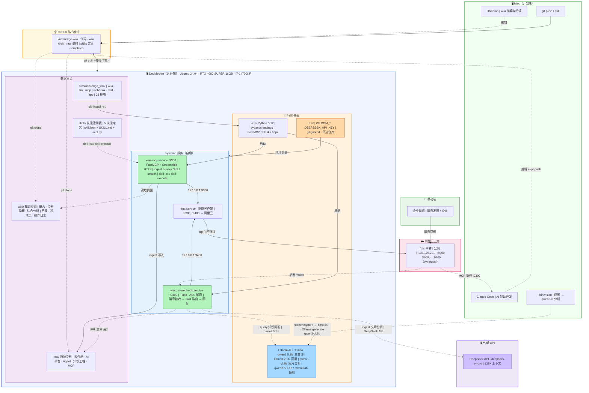
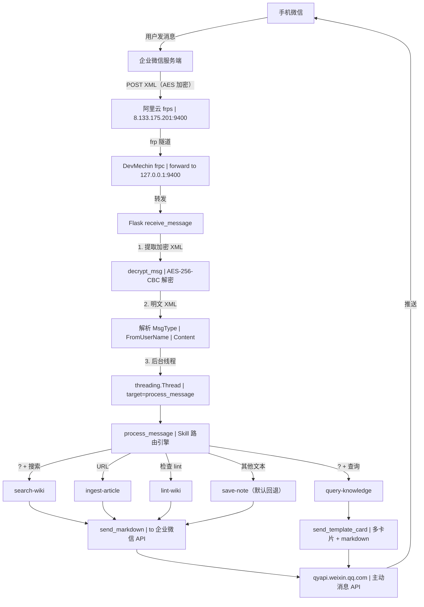
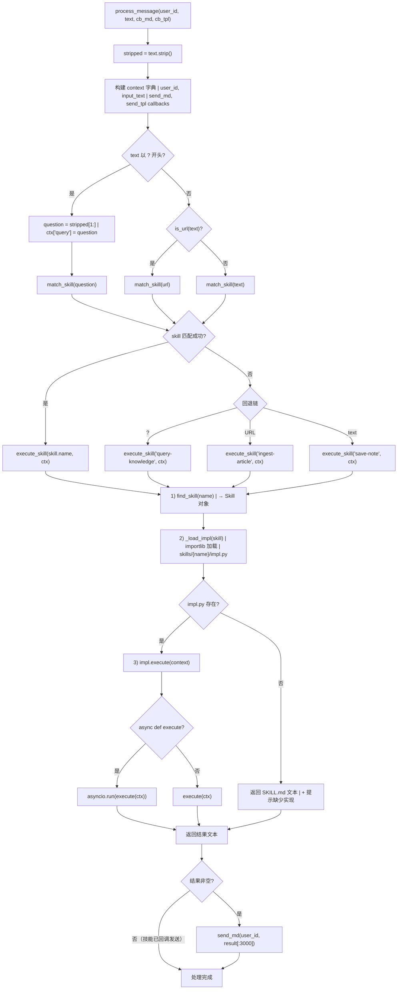
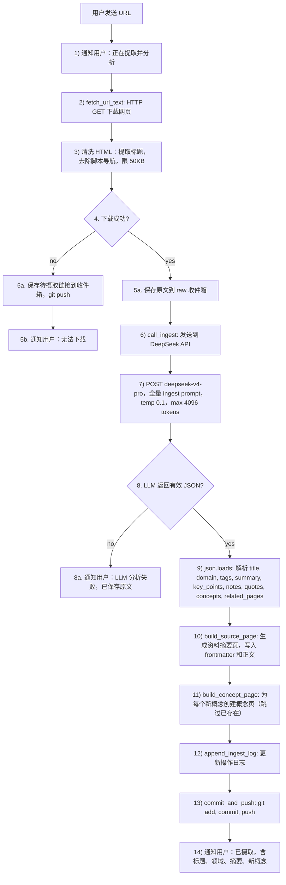
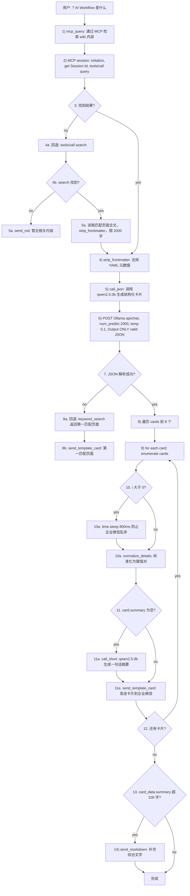
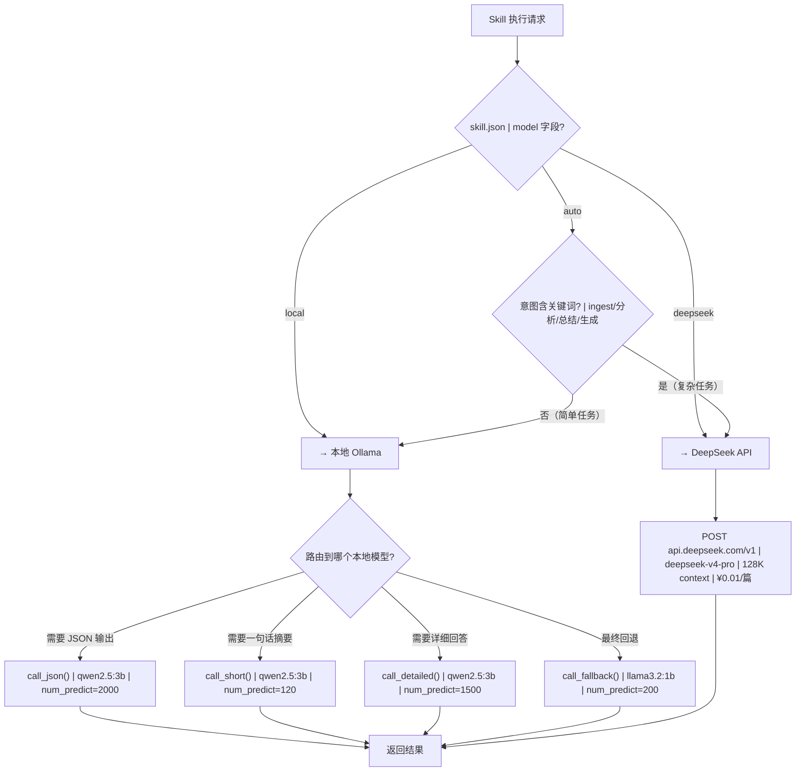
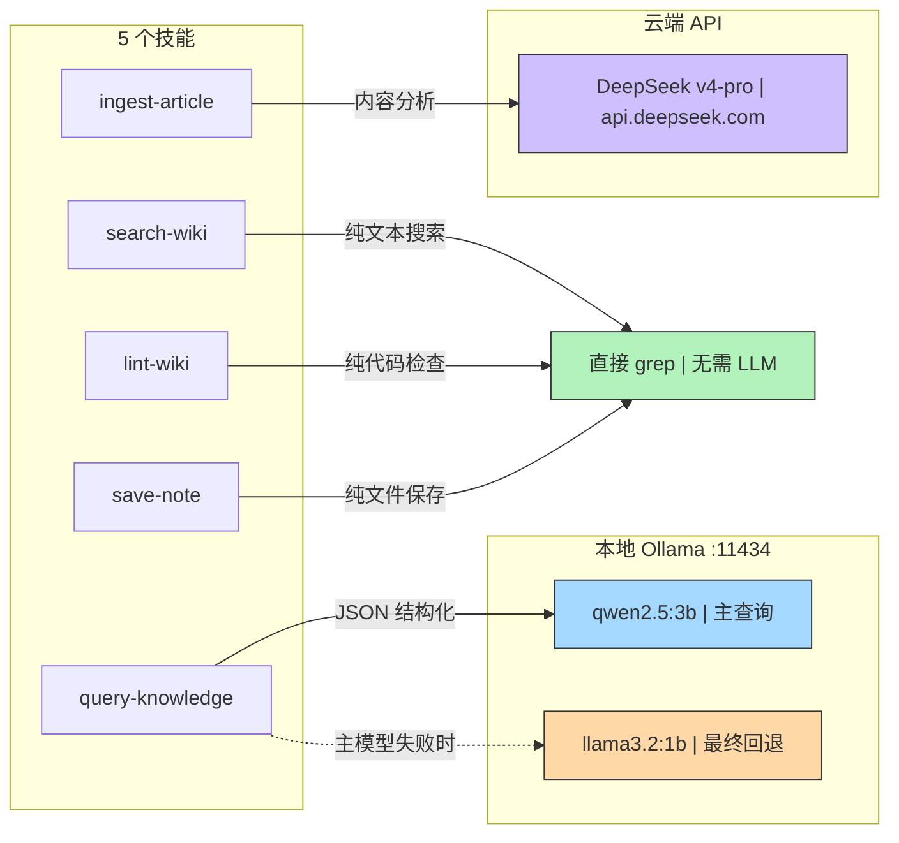

> Phase 2 完成后 knowledge-wiki 系统的完整流程图：全链路拓扑、消息处理、Skill 引擎、URL 摄取、知识查询、注册表加载、阶段对比，以及 DevMechin 本地模型清单、Ollama 查询容错链、模型路由决策与选型对照。

## 一、全链路部署拓扑



## 二、企业微信消息处理全链路



## 三、Skill 执行引擎内部流程



## 四、URL 摄取完整流水线（ingest-article）



## 五、知识查询流水线（query-knowledge）



**LLM 调用四级容错链**（内建于 `query-knowledge/impl.py`）：

```
qwen2.5:3b JSON
  └─ 失败 → keyword_search() 直接返回第一匹配页面
  └─ 成功 → 遍历 cards，每张 card.summary 为空时
              └─ qwen2.5:3b call_short() 一句话摘要
              └─ 失败 → 跳过该 card
多卡片发送后 → card_data.summary > 100 字时 send_markdown 补充
```

## 六、技能注册表加载流程

```mermaid
flowchart LR
    subgraph Filesystem["skills/ 文件系统（5 技能目录）"]
        SA["search-wiki | skill.json, SKILL.md, impl.py"]
        QA["query-knowledge | skill.json, SKILL.md, impl.py"]
        IA["ingest-article | skill.json, SKILL.md, impl.py"]
        LW["lint-wiki | skill.json, SKILL.md, impl.py"]
        SN["save-note | skill.json, SKILL.md, impl.py"]
    end
    Filesystem -->|"list_skills 扫描"| Scan["遍历 skills 子目录，读取 skill.json，生成 Skill 对象列表"]
    Scan --> Tier1["Tier 1 始终加载: search-wiki, query-knowledge, ingest-article, save-note"]
    Scan --> Tier2["Tier 2 按需加载: lint-wiki"]
    Tier1 --> Load2["load_skill_body: 读取 SKILL.md 全文，注入 Agent context"]
    Tier2 --> Load2
    Load2 --> Load3["load_skill_resources: 按需读取 scripts 和 references"]
```



## 七、各阶段对比

| | Phase 0（最初） | Phase 1（基座升级） | Phase 2（当前） |
|---|---|---|---|
| **代码组织** | 3 个独立 repo，2 个单文件脚本 | 统一 `src/knowledge_wiki/` 包 | 不变 |
| **消息分发** | 硬编码 `if/elif/else` | 硬编码 `if/elif/else` | Skill 引擎路由 |
| **技能系统** | 无 | `skill/` 骨架（占位） | 5 技能 + 执行引擎 |
| **LLM 调用** | 散落各处，接口不一 | 统一 `llm/` 包 | 不变 |
| **部署** | systemd 明文密钥 | `.env` + `EnvironmentFile` | 不变 |
| **测试** | 0 | 20 项 | 32 项 |
| **可扩展性** | 加功能 = 加 if/elif 分支 | 加功能 = 加模块 | 加功能 = 加技能目录 |

## 八、模型资源清单

### 本地模型（DevMechin Ollama · RTX 4080 16GB）

| 模型 | 大小 | 用途 | 调用函数 | 参数特征 |
|------|------|------|---------|---------|
| `qwen2.5:3b` | 1.9 GB | **主查询模型** — JSON 结构化输出 | `call_json()` | num_predict=2000, temp=0.1 |
| `qwen2.5:3b` | — | 一句话摘要 | `call_short()` | num_predict=120, temp=0.1 |
| `qwen2.5:3b` | — | 详细 markdown 回答 | `call_detailed()` | num_predict=1500, temp=0.3 |
| `qwen2.5:1.5b` | 986 MB | （备用）轻量中文推理 | — | 已安装，当前未调用 |
| `llama3.2:1b` | 1.3 GB | **最终回退** — 所有模型失败时 | `call_fallback()` | num_predict=200, temp=0.1 |
| `qwen3:4b` | 2.5 GB | （备用）中文通用推理 | — | 已安装，当前未调用 |
| `qwen3-vl:8b` | 6.1 GB | 图片解析（`~/bin/vision`） | — | 独立脚本，非 MCP 链路 |

### 云端模型

| 模型 | 提供商 | 用途 | 调用函数 | 参数特征 |
|------|--------|------|---------|---------|
| `deepseek-v4-pro` | DeepSeek API | **ingest 分析** — URL → wiki 结构化数据 | `call_ingest()` | max_tokens=4096, temp=0.1 |

### GPU 资源占用

```
RTX 4080 SUPER 16GB GDDR6X
├── qwen2.5:3b     ── 1.9 GB  ← 主查询（常驻显存）
├── qwen2.5:1.5b   ── 1.0 GB  ← 备用
├── llama3.2:1b    ── 1.3 GB  ← 回退（常驻显存）
├── qwen3:4b       ── 2.5 GB  ← 备用
├── qwen3-vl:8b    ── 6.1 GB  ← 图片（按需加载）
└── 剩余           ── ~3.2 GB  ← 可用
```

## 九、模型路由决策流程



## 十、模型与技能的对应关系



## 十一、模型选型决策表

| 决策因素 | qwen2.5:3b（主） | llama3.2:1b（回退） | deepseek-v4-pro |
|---------|------------------|--------------------|--------------------|
| **中文质量** | 优秀 | 一般 | 优秀 |
| **JSON 输出** | 较好（偶需修复） | 差 | 优秀 |
| **延迟** | 3-10s | 1-3s | 10-30s（网络） |
| **上下文** | 32K | 128K | 128K |
| **显存占用** | 1.9 GB | 1.3 GB | 0（云端） |
| **成本** | 免费 | 免费 | ¥0.01/篇 |
| **适用场景** | 查询 / 摘要 | 紧急回退 | 摄取分析 |

## 相关

- [[知识库系统工程化架构]]
- [[AI 自进化知识系统 — 建设路线图]]
- [[知识库系统全链路架构]]
- [[DeepSeek API 驱动 ingest — 架构与实现]]
- [[LLM Wiki 模式]]
- [[Wiki 目录]]
