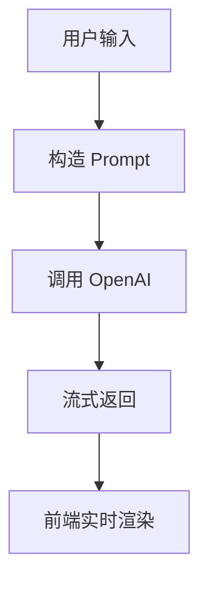
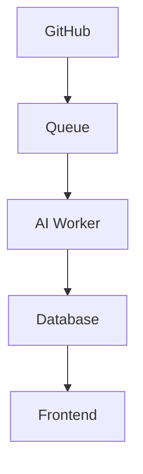

> 一份完整的 AI 日报/周报生成器项目规划文档，涵盖从 MVP 到 SaaS 产品化四个阶段的演进路线、技术选型和实现细节。

## 核心要点

- 项目分四个阶段：MVP → 工程化 → AI Workflow 化 → SaaS 产品化
- MVP 只需 2-5 天：文本输入 + AI API + 流式输出 + 历史记录 + 一键复制
- 技术栈推荐：Next.js + React + TypeScript + TailwindCSS + shadcn/ui
- AI SDK 推荐 OpenAI SDK 或 Vercel AI SDK
- 核心理念：先完成端到端最小闭环，再逐步复杂化

## 详细笔记

### 四阶段演进

| 阶段 | 目标 | 关键动作 |
|------|------|----------|
| Phase 1 | MVP（2-5天） | 文本输入→AI输出，localStorage |
| Phase 2 | 工程化 | 数据库、用户系统、模板系统、Markdown 导出 |
| Phase 3 | AI Workflow | GitHub/Jira/Slack 集成，周报自动生成，Tool Calling |
| Phase 4 | SaaS | 团队空间、Subscription、成本控制、多模型 |

### MVP 架构（数据流）

### Phase 3 架构

### 推荐技术栈演进

| 层面 | MVP | Phase 3-4 |
|------|-----|-----------|
| 前端 | Next.js + React + TailwindCSS | 同左 |
| AI SDK | OpenAI / Vercel AI | + Anthropic + Embedding |
| 存储 | localStorage | PostgreSQL + Redis |
| ORM | — | Prisma |
| 认证 | — | NextAuth / Clerk |
| 队列 | — | BullMQ |
| 部署 | — | Docker + Vercel + Cloudflare |
| 支付 | — | Stripe |

## 引用与数据

- MVP 不做的事情：登录、OAuth、支付、Jira、GitHub 集成
- 核心理念：「一个真正上线的小 AI 产品，比十个半成品 Demo 更有价值」

## 相关

- [[AI 日报生成器]]
- [[AI Workflow]]
- [[Wiki 目录]]
