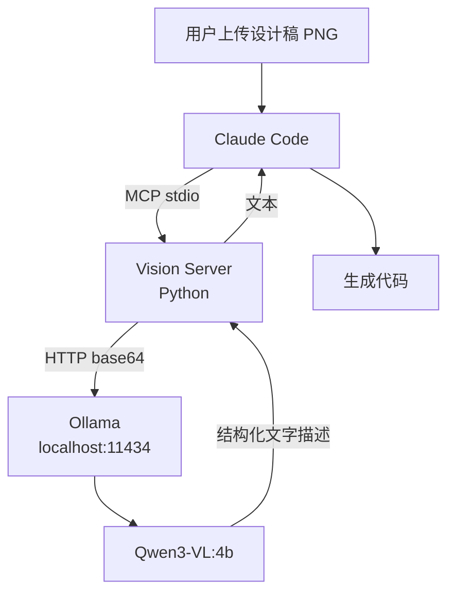

> 本地部署视觉语言模型（VL），通过 MCP Server 将 UI 设计稿截图转为结构化文字描述，再传给 Claude Code（搭配 DeepSeek V4 Pro 等纯文本模型）生成代码。

## 核心要点

- 动机：DeepSeek V4 Pro 是纯文本模型，无法直接读取设计稿图片
- 方案：Ollama 本地运行 Qwen3-VL:4b → MCP Vision Server（Python）→ Claude Code
- 最终模型选型 **Qwen3-VL:4b**（~2.7GB，Apache 2.0，中文 UI 识别优秀）
- 当前使用 LLaVA:7b 降级（Ollama v0.7.0 不兼容 Qwen3-VL）
- 总成本：**零** — Ollama 免费 + Qwen3-VL 开源 + 自建 MCP Server + 本地硬件

## 详细笔记

### 架构数据流

### 模型对比

| 维度 | Qwen3-VL:4b | LLaVA:7b |
|------|------------|----------|
| 大小 | ~2.7GB | ~4.1GB |
| 中文 UI | 优秀 | 较弱 |
| Ollama 要求 | v0.12.7+ | v0.7.0 |
| 参数量 | ~4B | ~7B |

### Qwen3-VL 全家桶

| 标签 | 大小 | 硬件 | 场景 |
|------|------|------|------|
| 2b | ~1.5GB | 边缘设备 | 简单识别 |
| **4b** ⭐ | ~2.7GB | 8GB RAM | **推荐** |
| 8b | ~5.5GB | 8GB+ GPU | 更强能力 |
| 30b MoE | ~20GB | 服务器 | 生产环境 |
| 235b MoE | — | 多卡 | SOTA |

### 实施步骤

1. 升级 Ollama → v0.24.0+
2. `ollama pull qwen3-vl:4b`
3. 创建 `~/mcp-servers/vision-server.py`（MCP stdio server）
4. 注册 `.mcp.json` + `settings.local.json`
5. 重启 Claude Code，发送设计稿即自动调用

### 当前状态

| 组件 | 状态 |
|------|------|
| Ollama v0.7.0 | ✅ 已安装，需升级 |
| LLaVA:7b | ✅ 可用但中文弱 |
| Qwen3-VL:4b | ❌ 需升级 Ollama 后拉取 |
| MCP Server | ✅ 已完成 |
| E2E 测试 | ✅ LLaVA 链路跑通 |

## 引用与数据

- MCP Server 代码量：~90 行 Python（`mcp` + `httpx`）
- 推理速度：4b 模型约 5-15 秒/张
- 自定义 Prompt：8 维度结构化输出（布局、导航、内容、文案、配色、间距、交互、细节）

## 相关

- [[MCP Vision Server 方案]]
- [[Ollama]]
- [[MCP（Model Context Protocol）]]
- [[DeepSeek]]
- [[Wiki 目录]]
